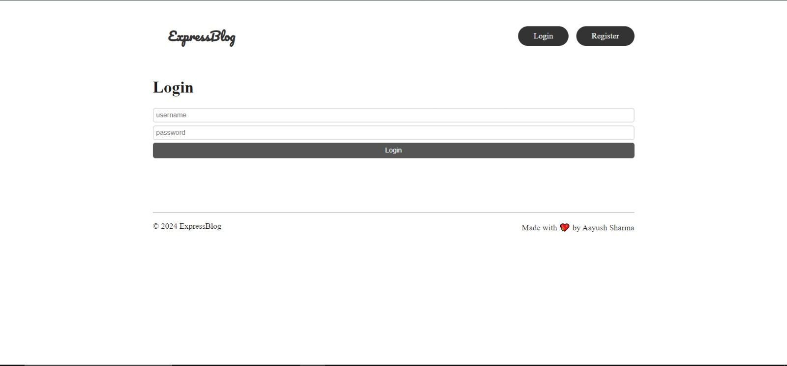

# Express Blog Application 📝
### Your Platform for Seamless Blogging

## Project Overview

Dive into the world of expressive content creation with the Express Blog App, a MERN stack marvel combining React.js, MongoDB, Express.js, and Node.js. This full-stack web blog application empowers bloggers with robust CRUD operations, user authentication, and a user-friendly rich text editor.

### Technology Stack
- Frontend: React.js
- Backend: Node.js, Express.js
- Database: MongoDB
- Authentication: JSON Web Tokens (JWT), bcrypt
- Styling: CSS
- Rich Text Editor: Quill.js

## Screenshots
### Home Page


### Login Page



### Blog Page


### Rich Text Editor


### Comments Section


## Features

### 🚀 MERN Stack Prowess 

- Harnessing the power of MongoDB, Express.js, React.js, and Node.js, the Express Blog App offers a comprehensive and seamless blogging experience with full-stack capabilities.

### 🔐 User Authentication 

- Ensure a secure and personalized experience with user authentication. Seamlessly register and log in to access exclusive blogging features and maintain the privacy of your content.

### ✏️ Rich Text Editor 

- Elevate your content creation process with a user-friendly rich text editor. Design and integrate captivating blog posts effortlessly, enhancing the visual appeal of your writing.

### 💬 Comments Feature 

- Engage with your readers through the comments section. Users can add comments to blog posts, creating a dynamic and interactive blogging environment.

### 🌐 Responsive Design 

- The Express Blog App is designed to adapt to various devices, providing a consistent and enjoyable experience for bloggers on desktops, tablets, and smartphones.

## Steps To Run Locally

### Prerequisites

- Node.js (v14 or higher)
- Git

### Installation

- Clone the repository

```bash
 git clone https://github.com/Aayush987/Express-Blog- 

 cd Express-Blog
```
### Backend Setup

- Create a .env file and add your mongodb Atlas URI and password to use database

```bash
cd Server
npm install
node index.js
```
- Server will be running on localhost:4000

### Frontend Setup

```bash
cd Client
npm install
npm run dev
```
- Client will be running on localhost:5173

## Conclusion
The Express Blog App offers a powerful platform for bloggers to create, manage, and share their content with ease. With a robust tech stack and intuitive features, it provides a seamless and enjoyable blogging experience. Start creating your expressive content today!✏️


